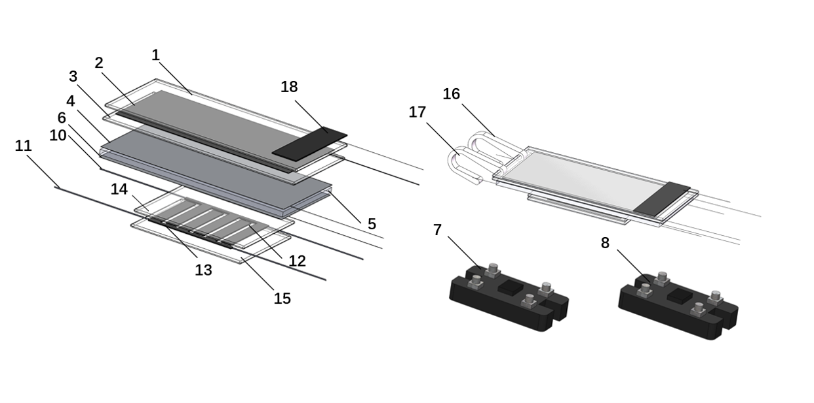
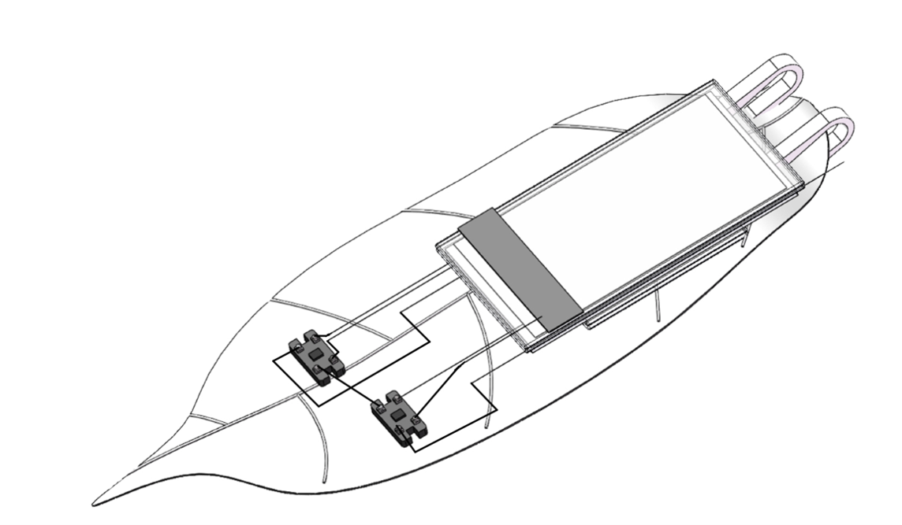
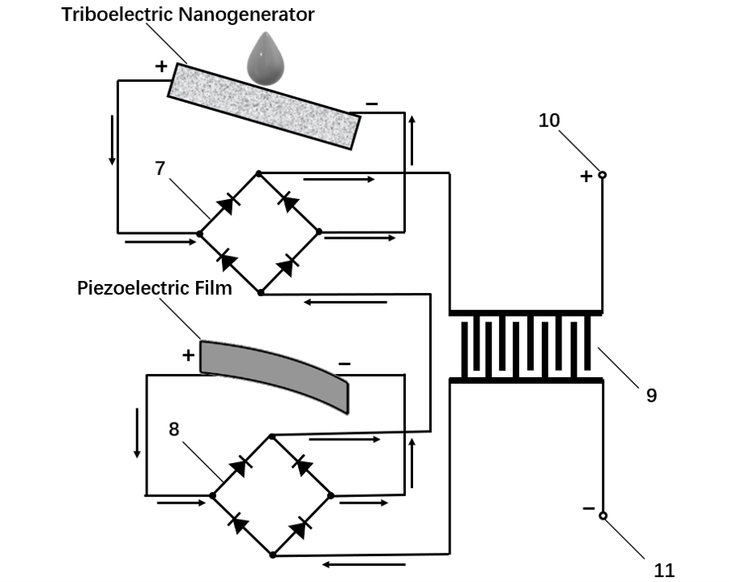

&nbsp;
# **research experience**

|**Research on superhydrophobic triboelectric nanogenerators.**|**Xi’an, China**|
| :- | -: |
|*Advisor: Prof. Zhifu Zhou, School of Energy and Power Engineering, **Xi’an Jiaotong University***|Sept. 2021 - May 2022|

- Improved the performance of flexible triboelectric nanogenerators through surface treatment technology and Laser-Induced Graphene technology.
- Enhanced the energy storage process of flexible triboelectric nanogenerators using Micro-Supercapacitor.
- Designed a Rainwater Energy Harvester using flexible triboelectric nanogenerators and piezoelectric materials.
- Composed a literature review report summarizing the research progress on wearable triboelectric nanogenerators.
- Wrote a national patent as the first student-author.

  

|**Bogoliubov Quasiparticle Interference Imaging of Unconventional Superconductors**|**Notre Dame, IN**|
| :- | -: |
|*Advisor: Prof. Xiaolong Liu, Department of Physics & Astronomy, **Notre Dame University***|May 2022 – Aug. 2022|

- Developed a MATLAB GUI to calculate the interference imaging of different materials.
- Compared calculated results with experimental observations.


|<b>Research on moiré excitons in MoSe<sub>2</sub>/WS<sub>2</sub> heterostructures</b>|**Berkeley, CA**|
| :- | -: |
|*Advisor: Prof. Feng Wang, Department of Physics, **UC Berkeley***|Jan. 2023 – Aug. 2023|

- Created devices of 2D materials and conducted optical measurements (absorption spectroscopy and photoluminescence measurements) on 2D devices and analyzed experimental data.
- Completed literature review of the MoSe2/WS2 system.
- Calculated the dipole-dipole interaction and exchange of excitons on moiré superlattices.

# **education**

|**Xi’an Jiaotong University**|**Xi’an, China**|
| :- | -: |
|*Bachelor of Science in Physics*|Sept. 2020 - June 2024|

- **Average Grade:** 90.02/100; **GPA:** 3.82/4.3
- **Courses:** Mechanics (100/100), Electromagnetism (90/100), General Thermal Physics (96/100), Optics (91/100), General Physics-Atomic Physics (99/100), Theoretical Mechanics (98/100), Electrodynamics (94/100), Mathematical Methods in Physics (95/100)
- **Honors:**
  - **Finalist Prize** of COMAP’s Mathematical Contest in Modeling (MCM)<sup>®</sup> (Top 2% of all participating teams worldwide) (2022)
  - School First Prize in Xi’an Jiaotong University (2022)
  - Outstanding student in Xi’an Jiaotong University (2022)
  - 2022 Provincial-level College Student Innovation Training Project - Excellent (2022)
  - 33rd Tengfei Cup School-level Excellence Award (2022)
  - Provincial First Prize in National Mathematics Contest (2021)


|**University of California, Berkeley**|**Berkeley, CA**|
| :- | -: |
|*Exchange Student*|Jan. 2023 – Aug. 2023|

- **GPA:** 4.00/4.00
- **Courses:** Quantum Mechanics (A+), Special Relativity and General Relativity (A+), Solid State Physics (A+)

# **patents**
- Zhou, Z., **Wang, Z.**, Tang, Z., et al. (2023). A plant-wearable self-powering system based on droplet frictional electricity and its method. Shaanxi Province: Patent Application No. CN115967297A


# **activities** 

|**Research on the Primary and Secondary School Enrollment System in Xi’an**|**Xi’an, China**|
| :- | -: |
|*Social Practice Activity*|May 2021 – Aug. 2021|

- Distributed questionnaires and conducted interviews with parents of primary and secondary school students, analyzed existing educational policies, and presented suggestions for improvement to the Education Bureau of Xi’an City


|**Xi’an Jiaotong University ABU-Robocon Robotics Team**|**Xi’an, China**|
| :- | -: |
|*A Member of Software Programming Group*|Aug. 2021 – Nov. 2021|

- Wrote and uploaded programs to STM32 microcontrollers using Keil and J-Link software

# **skills**
- **Technical skills:** MATLAB, LaTeX, Mathematica, Python, C++, SQL
- **Languages:** Mandarin (native), English (fluent)

# **Curriculum Vitae**[Link](https://github.com/ziyuwang-luke/ziyuwang-luke.github.io/blob/master/docs/CV_Ziyu%20Wang.pdf)


Text can be **bold**, _italic_, ~~strikethrough~~ or `keyword`.

[Link to another page](./another-page.html).

There should be whitespace between paragraphs.

There should be whitespace between paragraphs. We recommend including a README, or a file with information about your project.

# Header 1

This is a normal paragraph following a header. GitHub is a code hosting platform for version control and collaboration. It lets you and others work together on projects from anywhere.

## Header 2

> This is a blockquote following a header.
>
> When something is important enough, you do it even if the odds are not in your favor.

### Header 3

```js
// Javascript code with syntax highlighting.
var fun = function lang(l) {
  dateformat.i18n = require('./lang/' + l)
  return true;
}
```

```ruby
# Ruby code with syntax highlighting
GitHubPages::Dependencies.gems.each do |gem, version|
  s.add_dependency(gem, "= #{version}")
end
```

#### Header 4

*   This is an unordered list following a header.
*   This is an unordered list following a header.
*   This is an unordered list following a header.

##### Header 5

1.  This is an ordered list following a header.
2.  This is an ordered list following a header.
3.  This is an ordered list following a header.

###### Header 6

| head1        | head two          | three |
|:-------------|:------------------|:------|
| ok           | good swedish fish | nice  |
| out of stock | good and plenty   | nice  |
| ok           | good `oreos`      | hmm   |
| ok           | good `zoute` drop | yumm  |

### There's a horizontal rule below this.

* * *

### Here is an unordered list:

*   Item foo
*   Item bar
*   Item baz
*   Item zip

### And an ordered list:

1.  Item one
1.  Item two
1.  Item three
1.  Item four

### And a nested list:

- level 1 item
  - level 2 item
  - level 2 item
    - level 3 item
    - level 3 item
- level 1 item
  - level 2 item
  - level 2 item
  - level 2 item
- level 1 item
  - level 2 item
  - level 2 item
- level 1 item

### Small image


### Large image


### Definition lists can be used with HTML syntax.

<dl>
<dt>Name</dt>
<dd>Godzilla</dd>
<dt>Born</dt>
<dd>1952</dd>
<dt>Birthplace</dt>
<dd>Japan</dd>
<dt>Color</dt>
<dd>Green</dd>
</dl>

```
Long, single-line code blocks should not wrap. They should horizontally scroll if they are too long. This line should be long enough to demonstrate this.
```

```
The final element.
```
