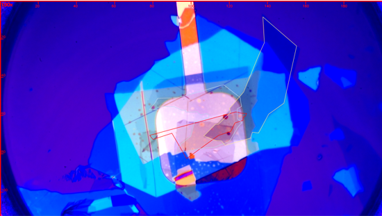
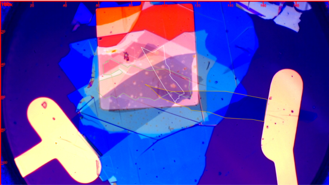
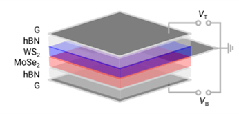
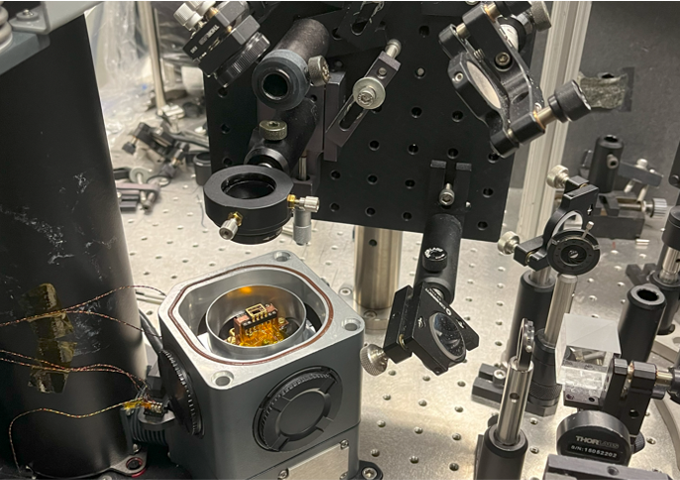
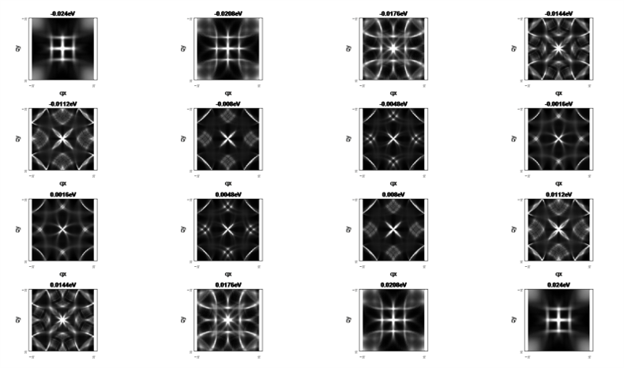

&nbsp;
# **research experience**

|<b>Research on moiré excitons in MoSe2/WS2 heterostructures</b>|**Berkeley, CA**|
| :- | -: |
|*Advisor: Prof. Feng Wang, Department of Physics, **UC Berkeley***|Jan. 2023 – Aug. 2023|

- Created devices of 2D materials and conducted optical measurements (absorption spectroscopy and photoluminescence measurements) on 2D devices and analyzed experimental data.
- Calculated the reflectance spectrum of given 2D devices using the transfer-matrix method.
- Calculated the dipole-dipole interaction and exchange of excitons on moiré superlattices.
 

 

 

 

|**Bogoliubov Quasiparticle Interference Imaging of Unconventional Superconductors** <a href="docs/Technical details of BQPI simulation.pdf" style="font-size:15px;">Link</a>|**Notre Dame, IN**|
| :- | -: |
|*Advisor: Prof. Xiaolong Liu, Department of Physics & Astronomy, **Notre Dame University***|May 2022 – Aug. 2022|

- Developed a MATLAB GUI to calculate quasiparticle interference patterns for different materials. Retrievable from [https://github.com/zyw2362382/BQPI_APP](https://github.com/zyw2362382/BQPI_APP).
- Calculated quasiparticle interference patterns of Bi2S2CaCu2O8+δ by giving a predicted energy band and energy gap structure and compared calculated results with experimental observations.
 

 

|**Research on superhydrophobic triboelectric nanogenerators**|**Xi’an, China**|
| :- | -: |
|*Advisor: Prof. Zhifu Zhou, School of Energy and Power Engineering, **Xi’an Jiaotong University***|Sept. 2021 - May 2022|

- Improved the performance of flexible triboelectric nanogenerators through surface treatment technology and Laser-Induced Graphene technology.
- Enhanced the energy storage process of flexible triboelectric nanogenerators using Micro-Supercapacitor.
- Designed a Rainwater Energy Harvester using flexible triboelectric nanogenerators and piezoelectric materials.
- Wrote a national patent as the first student-author. [link](docs/CN202211717835.pdf)
 

  

 

# **education**

|**Xi’an Jiaotong University**|**Xi’an, China**|
| :- | -: |
|*Bachelor of Science in Physics*|Sept. 2020 - June 2024|

- **Average Grade:** 90.02/100; **GPA:** 3.82/4.3
- **Courses:** Mechanics (100/100), Electromagnetism (90/100), General Thermal Physics (96/100), Optics (91/100), General Physics-Atomic Physics (99/100), Theoretical Mechanics (98/100), Electrodynamics (94/100), Mathematical Methods in Physics (95/100)
- **Honors:**
  - `Finalist Prize` of COMAP’s Mathematical Contest in Modeling (MCM)® (Top 2% of all participating teams worldwide) (2022)
  - School First Prize in Xi’an Jiaotong University (2022)
  - Outstanding student in Xi’an Jiaotong University (2022)
  - 2022 Provincial-level College Student Innovation Training Project - Excellent (2022)
  - 33rd Tengfei Cup School-level Excellence Award (2022)
  - Provincial First Prize in National Mathematics Contest (2021)

|**University of California, Berkeley**|**Berkeley, CA**|
| :- | -: |
|*Exchange Student*|Jan. 2023 – Aug. 2023|

- **GPA:** 4.00/4.00
- **Courses:** Quantum Mechanics (A+), Special Relativity and General Relativity (A+), Solid State Physics (A+)

 

# **patents**
- Zhou, Z., **Wang, Z.**, Tang, Z., et al. (2023). A plant-wearable self-powering system based on droplet frictional electricity and its method. China Patent Application No. CN115967297A. China National Intellectual Property Administration. [link](docs/CN202211717835.pdf)

 

# **activities** 

|**Research on the Primary and Secondary School Enrollment System in Xi’an**|**Xi’an, China**|
| :- | -: |
|*Social Practice Activity*|May 2021 – Aug. 2021|

- Distributed questionnaires and conducted interviews with parents of primary and secondary school students, analyzed existing educational policies, and presented suggestions for improvement to the Education Bureau of Xi’an City

|**Xi’an Jiaotong University ABU-Robocon Robotics Team**|**Xi’an, China**|
| :- | -: |
|*A Member of Software Programming Group*|Aug. 2021 – Nov. 2021|

- Wrote and uploaded programs to STM32 microcontrollers using Keil and J-Link software

 

# **skills**
- **Technical skills:** MATLAB, LaTeX, Mathematica, Python, C++, SQL
- **Languages:** Mandarin (native), English (fluent)

 

# **Curriculum Vitae**  <a href="docs/CV_Ziyu Wang.pdf" style="font-size:20px;">Link</a>

